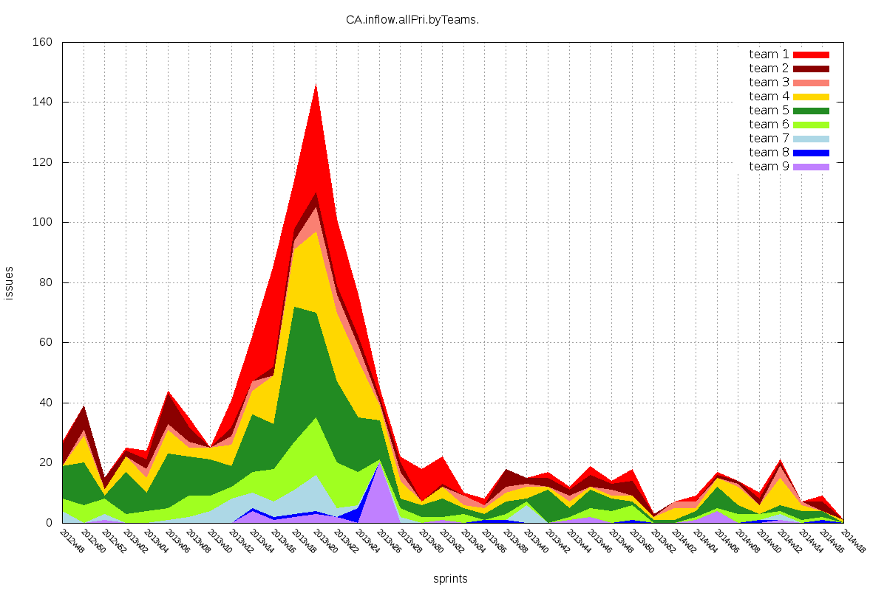
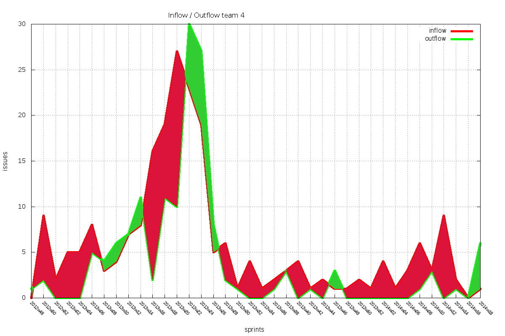

CAHistory
==================
Graph JIRA inflow and outflow of defects

- Retrieves defects inflow and outflow csv files from JIRA, using the [JIRA SQL interface](https://developer.atlassian.com/display/JIRADEV/Database+Schema)
- Maps assignee names to team names, following a given map
- Reduces defect inflow and outflow by names to a table of inflow/outflow by teams and sprints 
- Generate all teams inflow and outflow csv files
- Generate individual team combined inflow/outflow csv files
- Graph the results for all teams, with gnuplot
- Graph the results per team, with gnuplot

prerequisites:
==============
- Tested on Ubuntu 14.04
- psql (PostgreSQL) 	- tested with: 9.3.4
- gnuplot 			- tested with 4.6 patchlevel 4
- perl 5 				- tested with version 18, subversion 2 (v5.18.2)

Sample Graphs:
==============
##All teams combined inflow

##Individual team inflow/outflow

