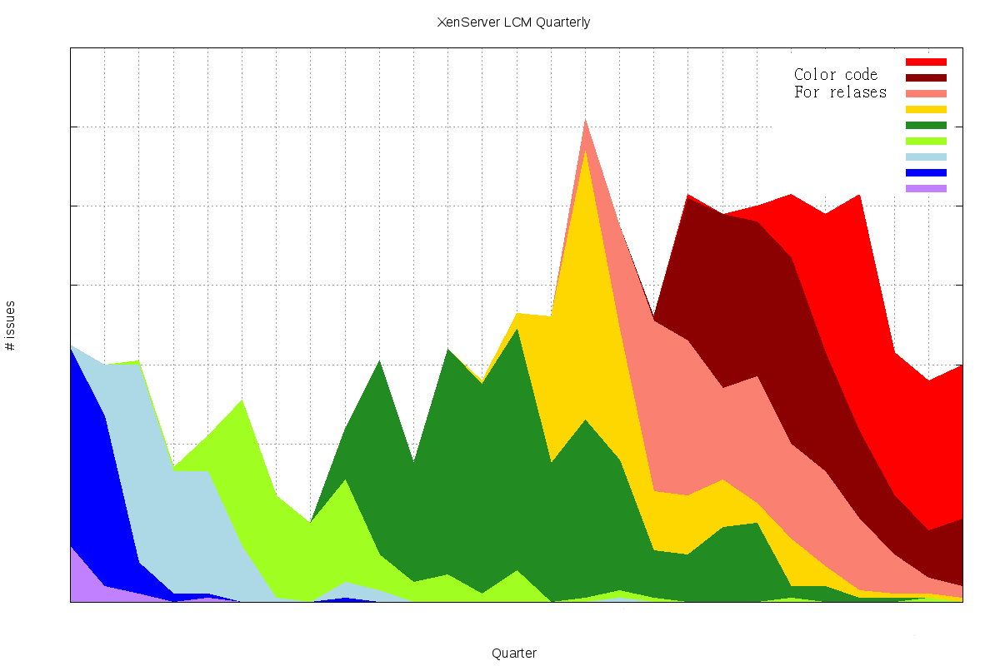

SCTXHistory
==================
Graph JIRA inflow of LCM defects by month and by quarter
- Retrieves LCM inflow csv files from JIRA, using the [JIRA SQL interface](https://developer.atlassian.com/display/JIRADEV/Database+Schema)
- Maps LCM to releases, following a given map
- Reduces number by month or quarters
- Graph the results, with gnuplot

prerequisites:
==============
- Tested on Ubuntu 14.04
- psql (PostgreSQL) 	- tested with: 9.3.4
- gnuplot 			- tested with 4.6 patchlevel 4
- perl 5 				- tested with version 18, subversion 2 (v5.18.2)

Sample Graphs:
==============

