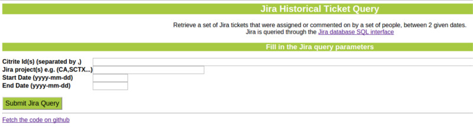
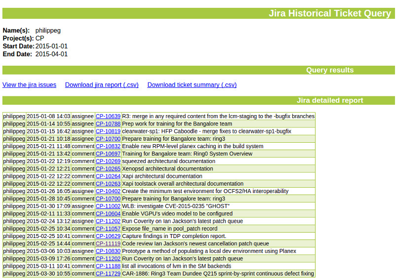
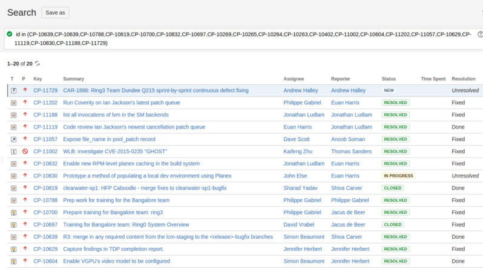

teamHistory
====

Retrieves Jira tickets, that were assigned to or commented by a person/group of persons, using the [JIRA SQL interface](https://developer.atlassian.com/display/JIRADEV/Database+Schema)

---
###Select person, project, begin and end dates

---
###View results

---
###View results in Jira

